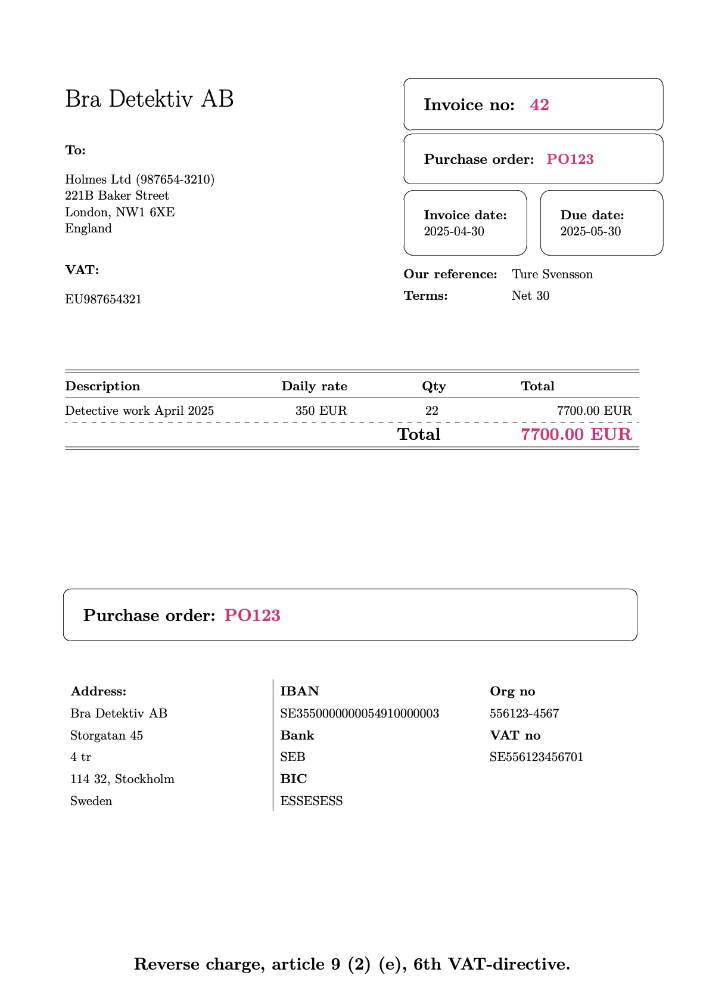

# LaTeX Invoice

A config **once**, inter-month-idempotent, calendar aware, capable and **maintenance-free** invoice solution written in LaTeX + Lua.

# Features

-   Config once: Set your company, client and project information using ENV vars in the `.envrc.secret` file (git ignored). **No LaTeX or Lua skills needed!**
-   Inter-month-idempotent: You build the invoice any number of times, it always results in the same invoice number when run within the same month. The proceeding month the next invoice number will be used.
-   Calendar aware: Using your machines system time to determine the month, it calculates the number of working days for the target month. Invoice date is set to last day of the target month and due date is set dependent on the payment terms set in your ENV config.
-   Capable: Supports setting number of days you were off, to be extracted from the automatically calculated number of working days. Supports expenses using "'<PRODUCT0>,<COST>,<QUANTITY>';'<PRODUCT1>,<COST>,<QUANTITY>'" CSV inspired string.
-   Maintenance free: The invoice number automatically set based on the current month. When you build the invoice the next month, the next number is used.

# Requirements

With minimal modification this ought to work on Linux too, but I've only verified it on macOS.

## `direnv`

Install [direnv](https://direnv.net/)

```sh
brew install direnv
```

Direnv allows your system to automatically to load the environment variables standing in this projects.

## LaTeX

There are two different ways of installing LaTeX on macOS. Either install [MacTeX](https://tug.org/mactex) which is a complete and very big distribution, which will eat up ~10 gb of your space. Use that if you have all that space to spare and want the easiest installation. Alternatively you can install TinyTex which is a much (typically 90%) smaller distribution. I recommend TinyTex since it is small and fast and it only has one extra required installation step which is fast and easy.

## TinyTex

Install [LaTeX (TinyTex) here](https://yihui.org/tinytex/)

```sh
curl -sL "https://yihui.org/tinytex/install-bin-unix.sh" | sh
```

You will be prompted for your password.

A package manager called `tlmgr` is now installed, we will use it in the next section to install some packages.

### Install LaTeX Packages

Install the following packages:

```sh
tlmgr install babel-english fancyhdr arydshln lastpage datetime2 fp ragged2e xstring fancybox luacode threeparttable
```

LaTeX should now be setup!

### Uninstalling MacTex

If you have previously installed MacTex and want to switch over to TinyTex, uninstall MacTex like so:

#### Remove MacTeX package files

Run this command in Terminal to remove the main MacTeX installation (typically 4-9 GB):

```sh
sudo rm -rf /usr/local/texlive
```

#### Remove the TeX Live utility symlinks

These links point to the binaries inside the MacTeX install.

```sh
sudo rm -rf /Library/TeX
```

You may also want to remove any profile entries from:

```sh
sudo rm /etc/paths.d/TeX
```

#### Remove GUI apps installed by MacTeX

These may include:

-   TeX Live Utility (/Applications/TeX)
-   TeXShop (/Applications/TeXShop.app)

You can delete them manually from the `/Applications` folder.

# Setup

Clone this repo, then cd to it.

## Create `.envrc.secret`

Make copy of [`.envrc.example`](.envrc.example) and call it `.envrc.secret`

```sh
cp .envrc.example .envrc.secret
```

Replace the placeholder values from [`.envrc.example`](.envrc.example) with your company, client and project values.

## Source and make

Source the updated environment variables by calling:

```sh
direnv allow .
```

And now call make:

```sh
make
```

Which will call out to `lualatex`.

# Usage

> [!NOTE]
> All environment variables references to in document are all set in `.envrc.secret` (which you should have copied over from `.envrc.example`).
> They will all be exported when you call `direnv allow .` (needed once and then after each change to `.envrc.secret`, which you typically only upon initial setup)

Build the invoice (`make` standing in the root of this project) on the first day month after the completed month. So if you have finished working in May, wait until June and build it. The invoice date will be set to `2025-05-31` and the due date will be set to `invoice day + $INVOICE_DAYS_DUE_AFTER_END_OF_MONTH`.

Set `INVOICE_NUMBER_BASE_OFFSET = 42` if you have sent 42 invoices already and want the next to invoice to be 43, in order for this to work you need also set `INVOICE_NUMBER_BASE_OFFSET_DATE_MONTH` and `INVOICE_NUMBER_BASE_OFFSET_DATE_YEAR` to the previous month (and relevant year).

> [!NOTE]
> The invoice will be named "<INVOICE*MONTH>\_invoice*<INVOICE_NUMBER>.pdf" and places in a folder next to the makefile called `invoices`.
> This name is inter-month-idempotent, running several times same month will use same name.
> Next month the next invoice will be generated with the subsequent month using the subsequent invoice number.

## Did not invoice at all for some month?

If you were out of office (OOO) for an entire month, maybe due to parental leave or long vacation or long term sickness, you can set increment `INVOICE_NUMBER_MONTHS_FREE` by how many numbers of months you where OOO. This allows you to not have to "hacky" decrement your `INVOICE_NUMBER_BASE_OFFSET` to get the correct invoice number for the next month.

## Out of office for **some** days?

If you were out of office for some days for the period you are invoicing you can call:

```sh
make DAYS_OFF=5
```

Which will subtract 5 from the number of working days that month (as calculated by the Lua script for you).

### Expenses

> [!IMPORTANT]
> `only_expenses` command requires you to insert the expenses string in
> `.encrc.secret` into INVOICE_EXPENSES_PER_MONTH dictionary. Because we need to offset
> the invoice number for all future invoices, depending on number of entries in
> `INVOICE_EXPENSES_PER_MONTH` and target date.

```sh
make only_expenses
```

# Example

If you build the invoice without changing any of the example values from [`.envrc.example`](.envrc.example), built with `make DAYS_OFF=3` it will look like this:



# How it works

`direnv` will source [`.envrc`](.envrc) which in turn will source [`.envrc.example`](.envrc.example) and then if `.envrc.secret` exists, it will source that, effectively overriding the values of `.envrc.example`. If you haven't created `.envrc.secret` yet the values of `.envrc.example` are used instead, or if you were to comment out or remove any variable from `.envrc.secret`, that variable won't be overridden.

The LaTeX main file [`invoice.tex`](src/invoice.tex) will include other helper files, such as [`logic.tex`](src/logic.tex) which in turn wraps the lua functions inside [`logic.lua`](src/logic.lua) as LaTeX commands.

# Contribute

We use `pre-commit` to run some soundness checks when you try to commit, such as checking for typos.

## Precommit

Install [`pre-commit` CLI tool](https://pre-commit.com/):

```sh
brew install pre-commit
```

## Install pre-commit hooks

```sh
pre-commit install
```
